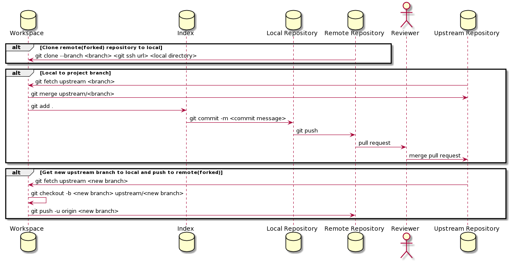

# Git

## Sample git workflow
### 

## ssh key

Refer to this [Link](https://help.github.com/en/github/authenticating-to-github/generating-a-new-ssh-key-and-adding-it-to-the-ssh-agent) for help creating ssh key.

## clone a branch from the forked repo
    git clone --branch <BRANCH> <URL> <LOCAL_FOLDER_PATH>

## find the origin and upstream
    git remote show origin 
    OR
    git remote -v

## change the remote and upstream
    git remote set-url origin <ORIGIN_REPO>
    The ORIGIN_REPO is the url for your forked repository

    git remote add upstream <UPSTREAM_REPO>
    The UPSTREAM_REPO is the repo from where you forked your repository

## fetch from upstream 
    git fetch upstream <BRANCH>
    git merge <upstream/BRANCH>

    git add .
    git commit -m "message"
    git push 

## upstream got a new branch

    Make sure you've pulled the new upstream branch into your local repo:
        First, ensure your working tree is clean (commit/stash/revert any changes)
        Then, git fetch upstream to retrieve the new upstream branch

    Create and switch to a local version of the new upstream branch (newbranch):
        git checkout -b newbranch upstream/newbranch

    When you're ready to push the new branch to origin:
    
## frequently used commands
    git fetch upstream <NEWBRANCH>
    
    git checkout -b <NEWBRANCH> upstream/<NEWBRANCH>
    
    git push -u origin <NEWBRANCH>
    
    git branch 
  
    in case you want to change to another branch 

    git checkout <ANOTHER_BRANCH

## Download/clone an existing github public repository without even having an account
    git clone https://github.com/<USERNAME>/<REPO> 

    Example: 
    git clone https://github.com/amitsaran/amitsaran.github.io.git

    Source:
    https://superuser.com/questions/557903/clone-github-repository-without-account
    
## Helpful Links
[A good read for some discussion around development process using git.](https://livablesoftware.com/development-process-in-github-basic-infographic/)
